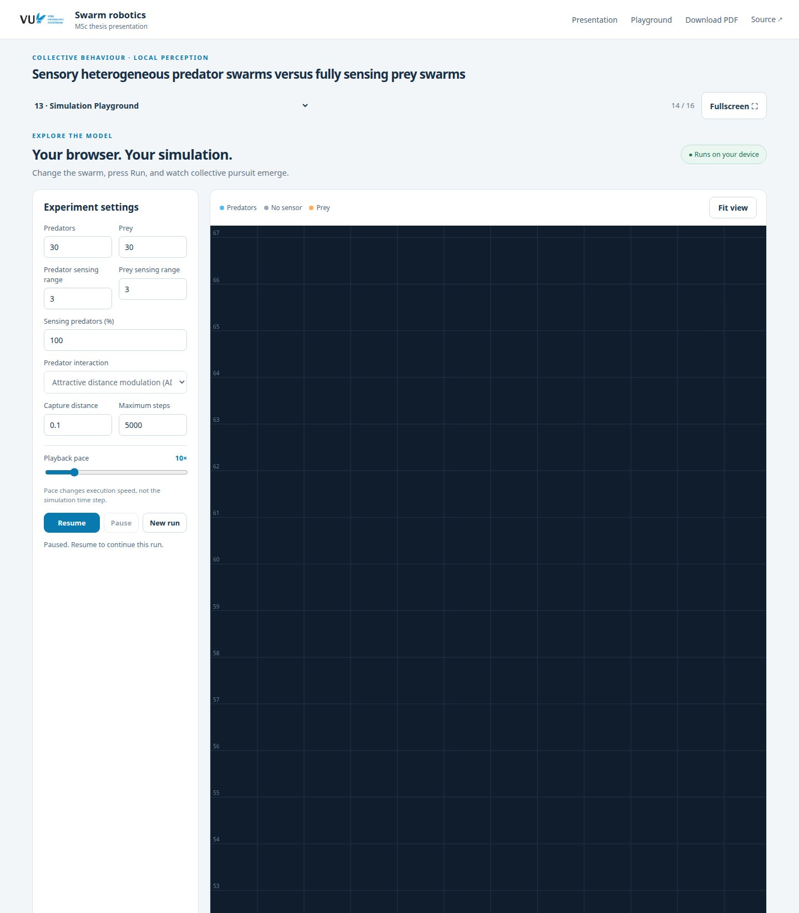

# Predator–prey swarm presentation

Interactive MSc thesis presentation by Sergio A. Gutierrez Maury. Explore the
published DM/ADM model with a Rust/WebAssembly simulation running in your browser.

[**Open the presentation**](https://sergi095.github.io/Thesis_presentation/)
· [**Try the simulation**](https://sergi095.github.io/Thesis_presentation/#/13)
· [Deployment](https://github.com/Sergi095/Thesis_presentation/actions/workflows/pages.yml)



## Local development

Use Node.js 22.12 or newer and Rust (CI uses 1.94.1).

```bash
npm ci
rustup target add wasm32-unknown-unknown
npm run build
npm run serve
```

Open http://127.0.0.1:4173/. Slide content is in `web/slides.json`, layouts in
`web/slide-layout.js` and `web/slides.css`, and the simulation core in `wasm/`.

## Validation and deployment

```bash
python3 -m pip install -r tests/requirements.txt
cargo test --locked --manifest-path wasm/Cargo.toml
python3 tests/physics_parity.py
npm run build
node tests/wasm_parity.mjs
npx playwright install chromium
npm test
```

The [GitHub Actions workflow](.github/workflows/pages.yml) tests the equations,
compiled WebAssembly and browser interface, then deploys successful `master`
builds to GitHub Pages. Pull requests run the same checks.

See [model provenance and numerical checks](docs/BROWSER_MODEL.md). The original
published figures and scientific content are retained. Build artifacts and test
screenshots stay out of Git; the preview above documents the current presentation.
