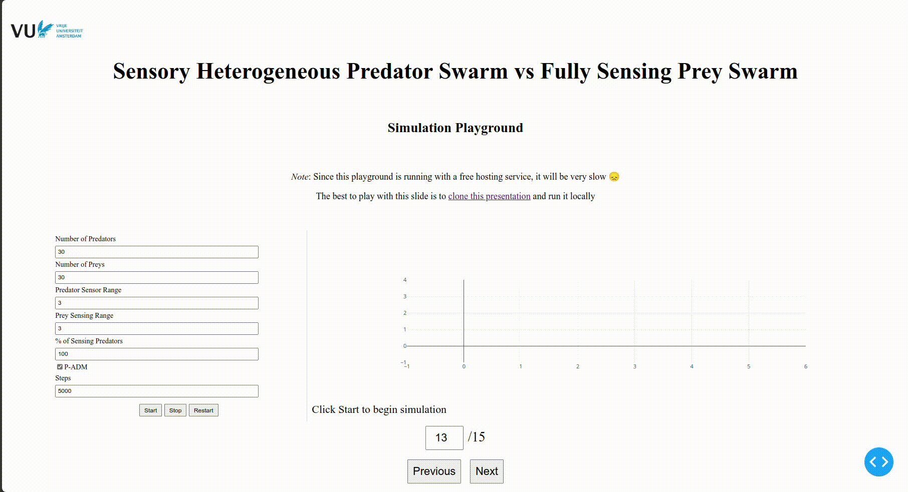

# MSc Thesis Presentation: Sensory Heterogeneous Predator Swarm vs Fully Sensing Prey Swarm

The [GitHub Pages presentation](https://sergi095.github.io/Thesis_presentation/)
includes the original slides and a refreshed interactive playground. The
simulation runs **on each visitor's computer**, using Rust/WebAssembly in a Web
Worker. No VPS, Python installation or server-side computation is needed by visitors.

- [Open the presentation](https://sergi095.github.io/Thesis_presentation/#/0)
- [Open the simulation](https://sergi095.github.io/Thesis_presentation/#/13)

This preserves the published DM/ADM model in this repository's `sim.py`. No
subsequent thesis experiments or unpublished data are included. The original
Dash application remains available below. See [model provenance and tests](docs/BROWSER_MODEL.md).

## Build and run the browser version locally

Build prerequisites: Node.js 22.12 or newer, Python 3, and Rust (CI uses 1.94.1).
Python is only used to export the old slide declaration at build time; there is
no Python server in the browser version.

```bash
npm ci
rustup target add wasm32-unknown-unknown
npm run build
npm run serve
```

Open http://127.0.0.1:4173/#/13. Serve `dist/` over HTTP; do not open the HTML as a
`file://` URL. All runtime assets, including Plotly, are built into `dist/`.

## Tests and automatic deployment

```bash
python3 -m pip install -r tests/requirements.txt
cargo test --locked --manifest-path wasm/Cargo.toml
python3 tests/physics_parity.py
npm run build
node tests/wasm_parity.mjs
npx playwright install chromium
npm test
```

The [Pages workflow](.github/workflows/pages.yml) runs Rust tests, compares against
the published Python model, builds WebAssembly, checks the compiled module, and
tests the browser presentation under a GitHub Pages subpath. Only passing builds
from `master` are deployed; pull requests run checks without publishing. A manual
workflow run is also available. Repository **Settings → Pages → Source** must be
**GitHub Actions**. Generated files, build output and test screenshots are not
committed to the repository.

## Original Dash version

The original Python application and its instructions remain available. Its
historical hosted address is https://sergi095.pythonanywhere.com/0.


### Anaconda
To run the app first you need to create an evironment. Here's how to do it with Anaconda.

```bash
$ conda create --name myenv
$ conda activate myenv
```
Then clone this repository:

```bash
$ git clone https://github.com/Sergi095/Thesis_presentation.git
$ cd Thesis_presentation
$ pip install -r requirements.txt # install the dependencies.
```


### Without Anaconda
You can also create a virtual environment with python. 

First, clone this repository
```bash
$ git clone https://github.com/Sergi095/Thesis_presentation.git
$ cd Thesis_presentation
$ python3 -m venv myenv # create an environment inside the repository
$ source myenv/bin/activate # activate it.
$ pip install -r requirements.txt # install the dependencies.
```


### Running the app

To run the app just do:

```bash
(myenv) $ python app.py
```

This will create a running app on localhost: http://127.0.0.1:8050/13

Then you can play with the simulation 😃


